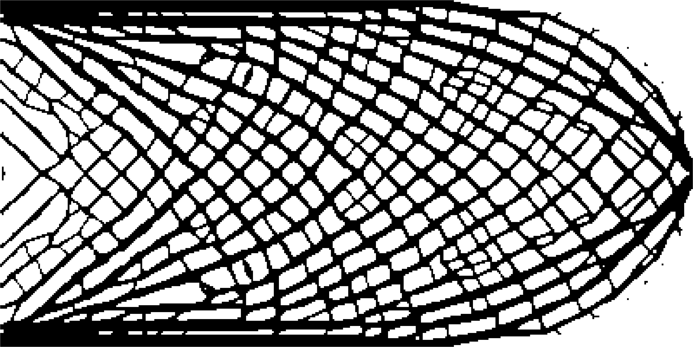
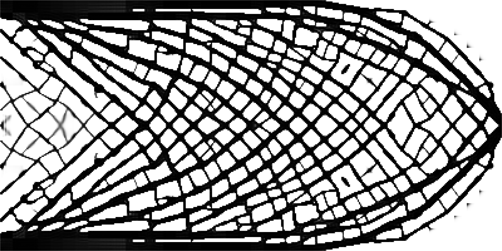
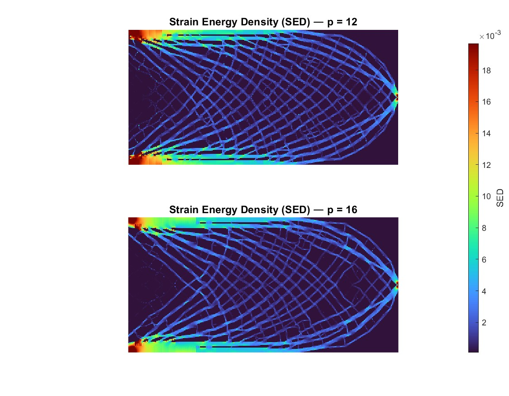

# porosity-pnorm-topopt
Porosity-controlled topology optimization using p-norm constraints and MMA, initialized via a strain-driven bone-remodeling algorithm

### Regional p-Norm Constraints with MMA and Bone Remodeling Reference


This repository presents a **porosity-controlled topology optimization framework** in which
regional material distributions are constrained to follow a **reference density field**
obtained from **bone remodeling simulations**.

The method combines:
- SIMP-based compliance minimization
- Regional porosity control via **p-norm aggregation**
- Density filtering and Heaviside projection
- Optimization using the **Method of Moving Asymptotes (MMA)**

The framework produces **manufacturable designs**, with direct export to CAD and STL formats.

---

## 🔧 Key Features

- **Regional porosity control**  
  The design domain is partitioned into regular subregions, each constrained to match a target
  reference density.

- **p-norm aggregation**  
  Regional porosity deviations are combined into a single smooth constraint, ensuring numerical
  stability and scalability.

- **Bone remodeling–driven reference**  
  The target density field (`rho_BR`) is obtained independently from a bone remodeling algorithm
  and used as a design reference.

- **Manufacturing-ready outputs**  
  Final designs are converted into CAD (`.x_t`, `.dxf`) and STL formats suitable for fabrication.

---

## Repository Structure

```text
Porosity-Controlled-Topology-Optimization/
├── README.md
├── src/
│   ├── bone_remodeling/
│   │   └── bone_remodeling.m
│   └── pnorm_mma/
│       ├── main_pnorm_mma.m
│       └── mmasub.m
├── results/
│   ├── p12_final_domain.png
│   ├── p16_final_domain.png
│   ├── compliance_comparison.png
│   ├── sed_comparison_single_scale.png
│   └── p12_evolution.gif
├── cad/
│   ├── p12_cad_model.PNG
│   ├── p12_final_design.dxf
│   ├── p12_final_design.stl
│   └── p12_final_design.x_t
└── assets/
    └── hero_render.png
```
---

## 🧠 Method Overview

### 1. Bone Remodeling Reference
A spatially varying reference density field `rho_BR` is generated using a bone remodeling
algorithm based on strain energy density.

This reference defines the **target porosity distribution**.
### 2. Topology Optimization Problem

**Objective**  
Minimize structural compliance.

**Constraints**
- Global volume constraint
- Regional porosity constraint enforced via p-norm aggregation

**Design variables**
- Element-wise densities with SIMP interpolation

### 3. Regional Porosity Constraint

The domain is divided into regular blocks.
The regional average density is defined as:
```text
`ρ̄_r = (1 / |r|) ∑_{e ∈ r} ρ_e`
```
The p-norm aggregated regional porosity constraint is defined as:

```text
f_por = (1 / N_r · Σ_r |ρ̄_r − ρ_r^ref|^p)^(1/p) − ρ_tol
```

This enforces a **global bound on regional porosity deviations** while remaining differentiable.

---
## ▶️ How to Run

### Step 1: Generate Reference Density
```matlab
rho_BR = bone_remodeling(...);
```
---
### Step 2: Run Topology Optimization
```matlab
xPhys = main_p_norm_mma(rho_BR);
```
Input
rho_BR: Reference density matrix from bone remodeling

Output
xPhys: Final physical density field

📊 Results
## Density Evolution (p = 12)

The figure below shows the evolution of the material density field throughout the optimization
process for p = 12.


Final Optimized Domains

| p = 12                            | p = 16                            |
| --------------------------------- | --------------------------------- |
|  |  |

## 📈 Compliance Comparison

The compliance history illustrates the convergence behavior and stiffness performance
of the optimized designs under different p-norm orders.


## Strain Energy Density (SED) Comparison

The strain energy density (SED) distribution is used to evaluate the mechanical response
of the optimized structures at the material point level.



🧱 CAD & Manufacturing Outputs

Final optimized designs are converted into:

STL for additive manufacturing

DXF for 2D workflows

Parasolid (.x_t) for direct CAD integration

Example:
```text
cad/
├── p12_final_design.stl
├── p12_final_design.dxf
└── p12_final_design.x_t
```

📌 Notes

No PDE-based filtering is used.

Density filtering and Heaviside projection ensure numerical stability.

The framework is modular and easily extendable.

📄 License

This project is intended for academic and research use.
Please cite appropriately if used in publications.
Commercial use requires permission from the author.


✉️ Contact

For questions, suggestions, or collaborations related to this work, feel free to reach out:

- **Author:** Musa Güngörürler  
- **Affiliation:** Mechanical Engineer, Biomechanics Ph.D. 
- **GitHub:** https://github.com/musagng  

If you use this work in academic research, please consider citing or referencing the repository.
